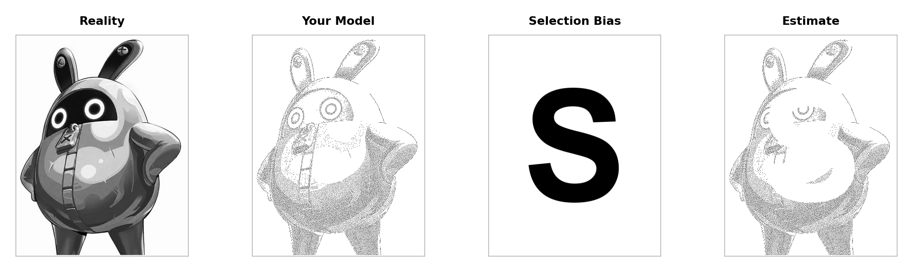

```{python}
#| include: false

import sys
import os
import importlib.util
from pathlib import Path

# --- resolve project directory ---

def _find_challenge_dir():
    markers = ("step1_prepare_image.py", "step5_create_masked.py")
    start = Path.cwd().resolve()
    for base in [start, *start.parents]:
        for m in markers:
            if (base / m).is_file():
                return base
        try:
            for sub in base.iterdir():
                if sub.is_dir():
                    for m in markers:
                        if (sub / m).is_file():
                            return sub
        except OSError:
            pass
    raise FileNotFoundError(
        "Cannot find challenge modules (e.g. step1_prepare_image.py). "
        "Open the selectionBiasChallenge folder as the workspace or cd into that folder."
    )


_root = _find_challenge_dir()
_p = str(_root)
if _p not in sys.path:
    sys.path.insert(0, _p)

from step1_prepare_image import prepare_image
from step2_create_stipple import create_stipple
from step4_create_block_letter import create_block_letter_s

# Load and prepare image
img_path = "Bamboo.jpg"
gray_image = prepare_image(img_path, max_size=512)

stipple_pattern, _ = create_stipple(
    gray_image,
    percentage=0.08,
    sigma=0.9,
    content_bias=0.9,
    noise_scale_factor=0.1,
    extreme_downweight=0.5,
    extreme_threshold_low=0.2,
    extreme_threshold_high=0.8,
    extreme_sigma=0.1,
)

h, w = gray_image.shape
block_letter = create_block_letter_s(h, w, letter="S", font_size_ratio=0.9)

_mod_path = _find_challenge_dir() / "step5_create_masked.py"
_spec = importlib.util.spec_from_file_location("step5_create_masked", _mod_path)
_step5 = importlib.util.module_from_spec(_spec)
_spec.loader.exec_module(_step5)
create_masked_stipple = _step5.create_masked_stipple

masked_stipple = create_masked_stipple(
    stipple_pattern,
    block_letter,
    threshold=0.5,
)


def _prepend_create_meme_path():
    candidates = []
    env = os.environ.get("QUARTO_PROJECT_DIR")
    if env:
        candidates.append(Path(env))
    if "__file__" in globals():
        candidates.append(Path(__file__).resolve().parent)
    here = Path.cwd()
    candidates.append(here)
    candidates.extend(here.parents)
    seen = set()
    for root in candidates:
        root = root.resolve()
        if root in seen:
            continue
        seen.add(root)
        if (root / "create_meme.py").is_file():
            s = str(root)
            if s not in sys.path:
                sys.path.insert(0, s)
            return


_prepend_create_meme_path()
from create_meme import create_statistics_meme

create_statistics_meme(
    original_img=gray_image,
    stipple_img=stipple_pattern,
    block_letter_img=block_letter,
    masked_stipple_img=masked_stipple,
    output_path="my_statistics_meme.png",
    dpi=150,
    background_color="white",
)
```



This meme shows selection bias by comparing the full image (Reality) to a stippled sample (Your Model), then marking a systematic “S” pattern where data are missing (Selection Bias). The last panel (Estimate) is distorted because loss follows that pattern rather than random missingness—so the picture we infer is biased, not a fair draw from the truth.
